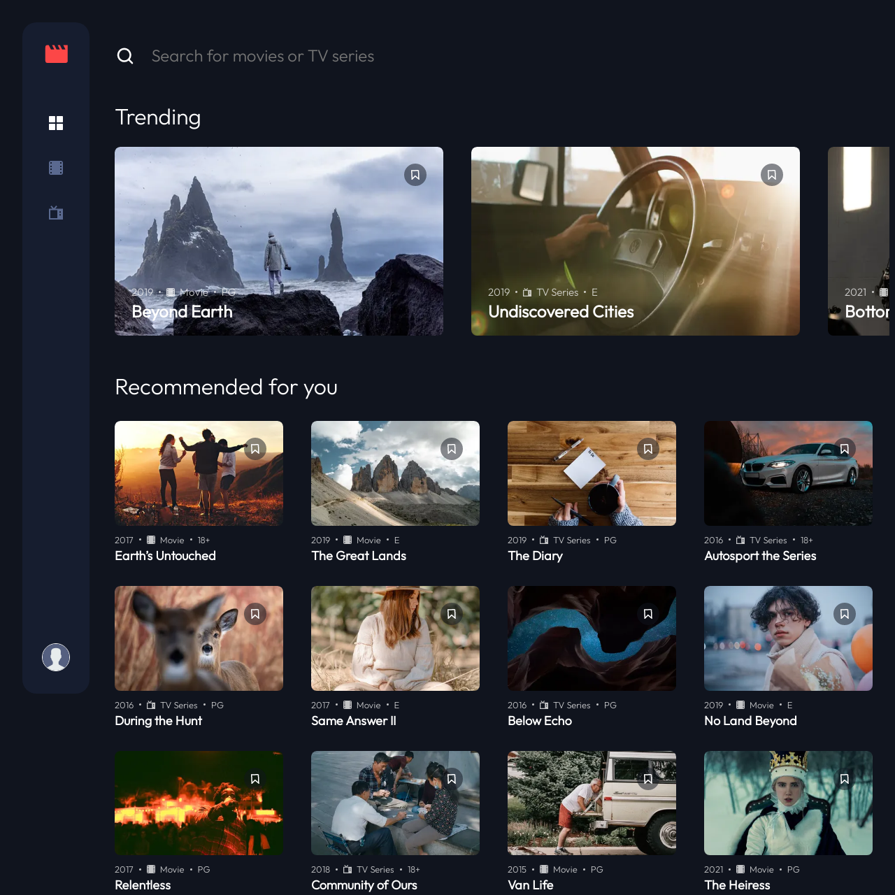

# Frontend Mentor - Entertainment API 

This is a solution to the [Frontend Mentor - Entertainment API](https://www.frontendmentor.io/challenges/entertainment-web-app-J-UhgAW1X). Frontend Mentor challenges help you improve your coding skills by building realistic projects.

## Table of contents

- [Overview](#overview)
  - [The challenge](#the-challenge)
  - [Screenshot](#screenshot)
  - [Links](#links)
- [My process](#my-process)
  - [Built with](#built-with)
  - [What I learned](#what-i-learned)
  - [Continued development](#continued-development)
  - [Useful resources](#useful-resources)
- [Author](#author)
- [Acknowledgments](#acknowledgments)

**Note: Delete this note and update the table of contents based on what sections you keep.**

## Overview

### The challenge

Users should be able to:

- See all countries from the API on the homepage
- Search for a country using an `input` field
- Filter countries by region
- Click on a country to see more detailed information on a separate page
- Click through to the border countries on the detail page
- Toggle the color scheme between light and dark mode *(optional)*

### Screenshot



### Links

- Solution URL: [solution URL here](https://github.com/okekevicktur/Entertainment-Web-App)
- Live Site URL: [live site URL here](https://bigvickz-entertainment.netlify.app/)

## My process

### Built with

- Semantic HTML5 markup
- CSS custom properties
- Flexbox
- CSS Grid
- Mobile-first workflow
- [Javascript](https://javascript.org/) - JS

### What I learned

I learnt animation, transition, and how to perform dynamic action in an array of data and sync across all other components

To see how you can add code snippets, see below:

```html
<div class="trend">
```

```css
.trend:hover, .recomd:hover {
    /* Brighten on hover */
    filter: brightness(1.2);
    /* Set transition duration and timing function */
    transition: filter 0.3s ease-in-out;
    /* Set transform on hover */
    transform: rotate(0deg);
    /* Set animation properties */
    animation-name: dangle;
    animation-duration: 2s;
    animation-timing-function: ease-in-out;
    animation-iteration-count: infinite;
    animation-direction:alternate-reverse;
  }
```

```js
function getMovies(input){
    const trends= movies
    .filter((movie) => movie.title === input);
    return trends;
 }
```

### Continued development

In my future learning, i will focus more on component styling, accessibiliy and react.

### Useful resources

- [For all my icons](https://www.fontawesome.com) - This helped me for all the icons in the project. I really liked the ease of integration and will use it going forward.
- [Fonts](https://fonts.google.com) - This is an amazing tool for various fonts and their sizes. 

## Author

- Website - [Victor Okeke](https://github.com/okekevicktur)
- Frontend Mentor - [@Vicktur](https://www.frontendmentor.io/profile/okekevicktur)
- Twitter - [@Vicscot1](https://www.twitter.com/Vicscot1)

## Acknowledgments

Thanks to Anambra Techies Community, every question i threw at them came back with a working answer.
